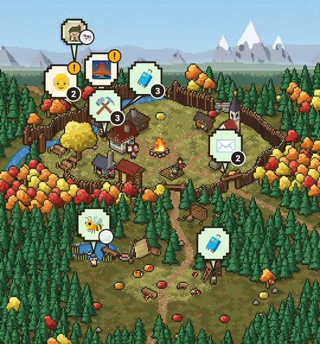
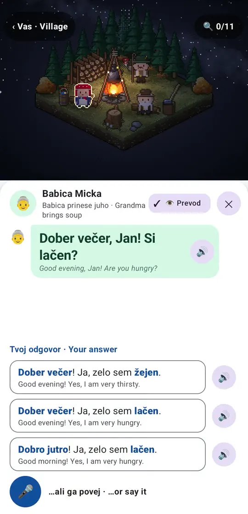
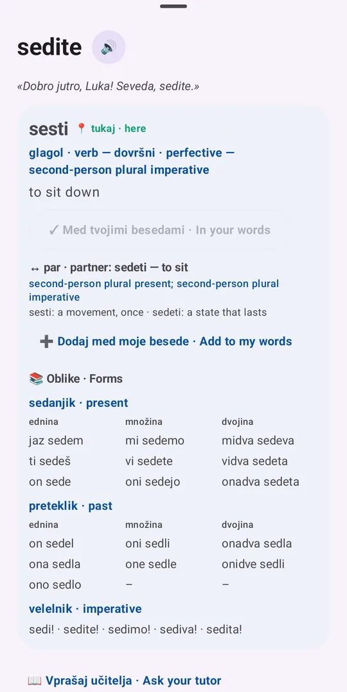
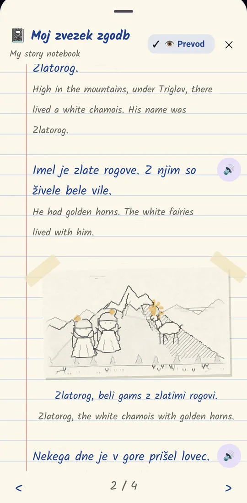

# Lani

[](LICENSE)
[](https://fentas.github.io/lani/)

<p align="center">
  
  
  
  
</p>

**Learn Slovene by living in a little village.** Lani is an Android game with a pixel-art village whose people speak
to you, a tutor that knows what you got wrong yesterday, and a grammar book that opens as you go. Behind it runs a
Claude Code session: your own tutor, which writes new dialogs, stories and exercises for you as you progress.

→ **[fentas.github.io/lani](https://fentas.github.io/lani/)** for a tour with pictures.

> Lani is in early, active development and is used daily by one learner (Jan). Slovene is the first language;
> Italian (Friuli), German (Kärnten) and English (Lakeland) villages exist for visits.

## What's in it

- **The village.** A dozen villagers with their own days: the farmer in his field, the smith at his forge, Stari
  Janez telling a legend by the fire every evening. They ask you for help in Slovene; what you build with their
  requests grows the village.
- **Scenes and dialogs.** Close-up scenes (the kitchen, the fire, the field) where you find the words in the picture
  and talk to people. Dialog turns adapt to you: choose, tap the picture, type the missing word, or say it.
- **A grammar book that grows with you.** The six cases, aspect, the dual: a page opens when you're ready for it, the
  dialogs only ask for what you've met, and your mistakes show up on the rule's page.
- **Words that stay.** Spaced repetition (SM-2) in many forms: flashcards, listening, dictation, speaking, and once
  you know a word, its conjugations and cases as the grammar book opens them.
- **Stories and a notebook.** Legends told in chapters by the fire (Martin Krpan, Zlatorog, Peter Klepec), each
  written down in a hand-drawn notebook with sketches.
- **In the car.** An Android Auto mode with listening drills, echoes and quick responses for long drives.
- **A tutor you can talk to.** The app's chat goes to your Claude Code session: ask about any exercise, bookmark an
  answer, reply to a message from last week.

## How it works

```
Android app ──HTTP/SSE──► bridge (Bun/TS) ──MCP channel──► Claude Code session (your tutor)
                            │                              └─ skills: lani-*, lani-studio
                            └─ your data: progress, mistakes, reviews, village (JSON, on your machine, in git)
```

- `companion/android/` — the app (Kotlin, Jetpack Compose); the village, scenes and people are drawn in code.
- `companion/bridge/` — the bridge: serves the app, keeps your data, and lets the tutor publish content.
- `companion/cultures/`, `companion/scenes/`, `companion/grammar/` — the villages, scenes, stories and grammar pages.
- `.claude/` — the tutor's skills and hooks; `LEARNING_SYSTEM.md` is its method.

## Run it yourself

You need a machine that stays on (Linux or macOS), [Claude Code](https://code.claude.com) with a Claude plan or API
key, [Bun](https://bun.sh) and an Android phone. A wizard sets up the rest in about 15 minutes:

```bash
git clone https://github.com/fentas/lani.git && cd lani
companion/bin/lani-setup                     # the learner, their data, a private remote, voices, network, pairing
```

It keeps the learner's data outside the checkout, as a git repository of its own (`~/.local/share/lani/<id>`),
committed after each session. Run it again to change anything. The guide, and the steps by hand:
[docs/setup.md](docs/setup.md); what leaves your machine: [docs/privacy.md](docs/privacy.md); when something is off:
[docs/troubleshooting.md](docs/troubleshooting.md). Everything else (pairing, Tailscale, voices, speech recognition, the
bridge as a service, backups) is in [companion/README.md](companion/README.md). The tutor also works on its own, in the
terminal: [docs/claude-tutor.md](docs/claude-tutor.md).

## Contributing

Corrections to the Slovene are especially welcome: much of the content is machine-written and marked so until a
native speaker has read it. See [CONTRIBUTING.md](CONTRIBUTING.md).

## Licence

Lani is free software under the [GNU Affero General Public License 3.0 or later](LICENSE). It began as a fork of
[m98/fluent](https://github.com/m98/fluent) (MIT); the parts from it stay available under MIT as well (an install
from the time it was called Fluent moves over with [docs/migrate-from-fluent.md](docs/migrate-from-fluent.md)). Dictionary
data from Wiktionary (CC BY-SA 4.0), the Kalam font (OFL) and the synthesized sounds (CC0): see [NOTICE.md](NOTICE.md).
